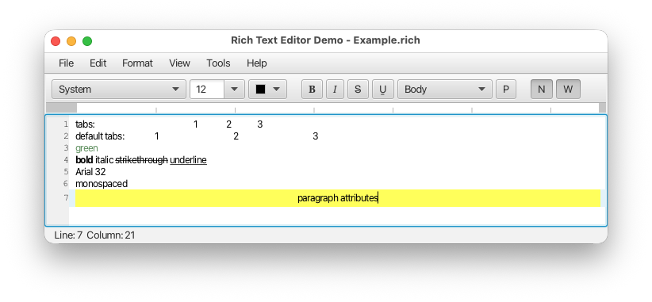
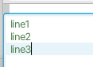

# Rich Text Area (Incubator) Data Format

Andy Goryachev

Version 4

June 17, 2026


## Summary

This document describes the data format used by `RichTextModel`, the default model used by the `RichTextArea`'s control.

WARNING: This format (as a part of an incubator module) is likely to change once the decision is made to integrate it
into the JavaFX core.


## Description

The document is persisted as a UTF-8 encoded plain text file which contains a sequence of segments.
The first segment is the version, the second is the document properties segment, followed by one or more segments
representing the paragraphs.

Each paragraph is represented by character attribute segment(s), one segment per attribute,
the paragraph text segments, paragraph attribute segment(s), also one segment per attribute,
terminatedby a single `LF` character.


### Example

As an example, the following rich text



is represented by the following file:

```
{@RichText-v4-incubator}{#tabs|99.5}{ff|System}{fs|12.0}tabs:	1	2	3{!tabs|149.0,190.0,229.0}
{0}default tabs:	1	2	3{!}
{ff|System}{fs|12.0}{tc|669966}green{!}
{b}{ff|System}{fs|12.0}bold {ff|System}{fs|12.0}{i}italic {ff|System}{fs|12.0}{ss}strikethrough{4} {ff|System}{fs|12.0}{u}underline{!}
{ff|Arial}{fs|32.0}Arial 32{!}
{ff|System}{fs|12.0}{tc|000000}monospaced{!}
{8}paragraph attributes{!bg|FFFF4D}{!bullet}{!dir|L}{!spaceAbove|3.0}{!spaceBelow|4.0}{!spaceLeft|1.0}{!spaceRight|2.0}{!alignment|C}
```

In this example, the document properties are enclosed in `{# }`, each paragraph attribute is enclosed in `{! }`,
each character attribute is enclosed in `{ }`.


### Format Version Segment

The first segment determines the format version, enclosed in `{@ ... }`.
There could be only one such segment and it must be the first one.

Example:

`{@RichText-v4-incubator}`


### Document Properties Segment

The second segment is a document properties segment which contains a pipe-delimited key-value pairs enclosed in `{# ... }`.
There is only one document properties segment per file.

Example:

`{#tabs|99.5}`

specifies the document property `tabs` (default tab stops in pixels) with a numeric value of `99.5`.


#### Document Properties

|Key     |Type       |Default Value|Comments
|:-------|:----------|------------:|:----------------------------------
|tabs    |double     |0            |default tab stops in pixels when greater than 0, Note 1.

Notes:

1. value of 0 results in a legacy behavior where the tab spacing corresponds to 8 spaces.
This may result in milasigned columns when different text segments use different fonts.  Value of -1 disables
the default tab stops, rendering the tabs as single spaces.


### Character Attribute Segment

The character attributes control the style of the following text up to the end of the current paragraph.

Each character attribute is enclosed in curly braces, and contains either the attribute name (for the boolean attributes),
or the attribute name with the value separated by the `|` symbol.

An empty attribute is represented by `{}` and indicates the beginning of the next text segment:

Example:

```
{name}
{name|value}
{}
```

#### Character Attributes

|Name    |StyleAttributeMap     |Type        |Description                                                      |
|:-------|:---------------------|:-----------|:----------------------------------------------------------------|
|b       |BOLD                  |boolean     |Bold typeface
|ff      |FONT_FAMILY           |String      |Font family (Note 1)
|fs      |FONT_SIZE             |double      |Font size (Note 2)
|hi1     |TEXT_HIGHLIGHT_1      |boolean     |Text highlight color 1
|hi2     |TEXT_HIGHLIGHT_2      |boolean     |Text highlight color 2
|hi3     |TEXT_HIGHLIGHT_3      |boolean     |Text highlight color 3
|hi4     |TEXT_HIGHLIGHT_4      |boolean     |Text highlight color 4
|hi5     |TEXT_HIGHLIGHT_5      |boolean     |Text highlight color 5
|i       |ITALIC                |boolean     |Italic typeface
|ss      |STRIKE_THROUGH        |boolean     |Strike through
|tc      |TEXT_COLOR            |Color       |Text color (Note 3)
|u       |UNDERLINE             |boolean     |Underline
|uw1     |UNDERLINE_WAVY_1      |boolean     |Wavy underline color 1
|uw2     |UNDERLINE_WAVY_2      |boolean     |Wavy underline color 2
|uw3     |UNDERLINE_WAVY_3      |boolean     |Wavy underline color 3


Notes:

1. the standard JavaFX font substitution is performed to render text when the specified font family cannot be found.
2. must be > 0 and finite
3. 6 hex digits `RRGGBB`.  Example: {tc&#x007c;4D804D}


#### Embedded Images

Embedded images are coded as character attributes with the tag `img`.
The data portion of the attribute specifies the following comma-delimited fields:

|Code    |Type          |Description                                                     |
|:-------|:-------------|:---------------------------------------------------------------|
|a       |boolean       |Keep aspect ratio
|b       |byte[]        |Base64-encoded image data
|h       |double        |Original image height
|th      |double        |Target height (Note 1)
|tw      |double        |Target width (Notes 1, 2)
|w       |double        |Original image width

Notes:

1. Value of `0.0` indicates that the rendered image height or width should be computed according to the image
   intrinsic aspect ratio.
2. Value of `-1.0` indicates that the rendered image width should not exceed the view's wrapped text width.
   Value of `-2.0` indicates that the rendered image width should always fit the view's wrapped text width.


Example:

`{img|w,138.0,h,102.0,tw,-1.0,th,-1.0,a,true,b,iVBORw0KGgoAAA...}`


### Text Segment

A text segment is represented by a simple sequence of characters.


### Paragraph Attribute Segment

The character attribute and text segments are followed by one or more paragraph attribute segments.

A special token `{!}` indicates that the paragraph contains no attributes.

```
{!name}
{!name|value}
{!}
```

#### Paragraph Attributes

|Name         |StyleAttributeMap      |Type                |Comments                                                      |
|:------------|:----------------------|:-------------------|:-------------------------------------------------------------|
|alignment    |TEXT_ALIGNMENT         |TextAlignment       | `C`, `J`, `L`, `R`
|bg           |BACKGROUND             |Color               | 6 hex digits `RRGGBB`.  Example: {bg&#x007c;4D804D}
|bullet       |BULLET                 |String              |
|dir          |PARAGRAPH_DIRECTION    |ParagraphDirection  | `L`, `R`
|firstIndent  |FIRST_LINE_INDENT      |double              | must be >= 0 and finite
|lineSpacing  |LINE_SPACING           |double              | must be >= 0 and finite
|spaceAbove   |SPACE_ABOVE            |double              | must be >= 0 and finite
|spaceBelow   |SPACE_BELOW            |double              | must be >= 0 and finite
|spaceLeft    |SPACE_LEFT             |double              | must be >= 0 and finite
|spaceRight   |SPACE_RIGHT            |double              | must be >= 0 and finite
|tabs         |TAB_STOPS              |double[]            | comma-separated list


### Escaping Special Symbols

Some characters that might be confused with attribute syntax or delimiters are represented by their hexadecimal
ASCII values:

|Character    |Escape Sequence      |
|:------------|:------------------- |
|`%`          |`%25`
|`{`          |`%7B`
|`\|`         |`%7C`
|`}`          |`%7D`


### Style Compression

To avoid repeating the same attributes over and over, the format employs a form of compression, where the duplicate
attributes are replaced by a numeric tokens:

```
{number}
{!number}
```

where `number` is the index of the duplicate attribute map in the document.

Example:



```
{tc|4D804D}line1{!}
{0}line2{!}
{0}line3{!}
```

