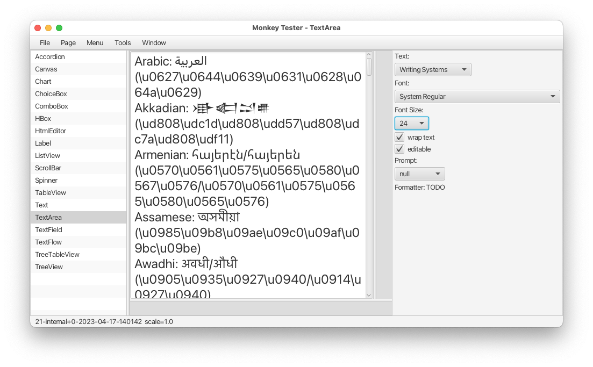

# Monkey Tester

This is a testing tool developed to support manual ad-hoc testing of individual JavaFX controls.




## Prerequisites

JavaFX SDK 25+ and the matching JDK are required to build and run the tool.
You can use a JavaFX SDK that you build or you can download the JavaFX SDK found here:

https://jdk.java.net/


## Build

The tool uses `ant` to build a non-modular JAR.  You'll need to specify the path to JavaFX SDK
using absolute path:
```
ant -Djavafx.home=<JAVAFX>
```


## Run

To launch, specify the path to the JavaFX SDK lib/ folder on the command line, example:

```
java -p <JAVAFX>/lib/ --add-modules ALL-MODULE-PATH -jar MonkeyTester.jar
```


## User Preferences

Applications stores the user preferences (window position, currently selected page, etc.) in `~/.MonkeyTester` directory.

To use a different directory, for example to run multiple instances of MonkeyTester without
having them fight over the preferences, one can redefine the `user.home` system property,
`-Duser.home=<DIR>`.

To disable loading and saving, specify `-Ddisable.settings=true` VM argument.
