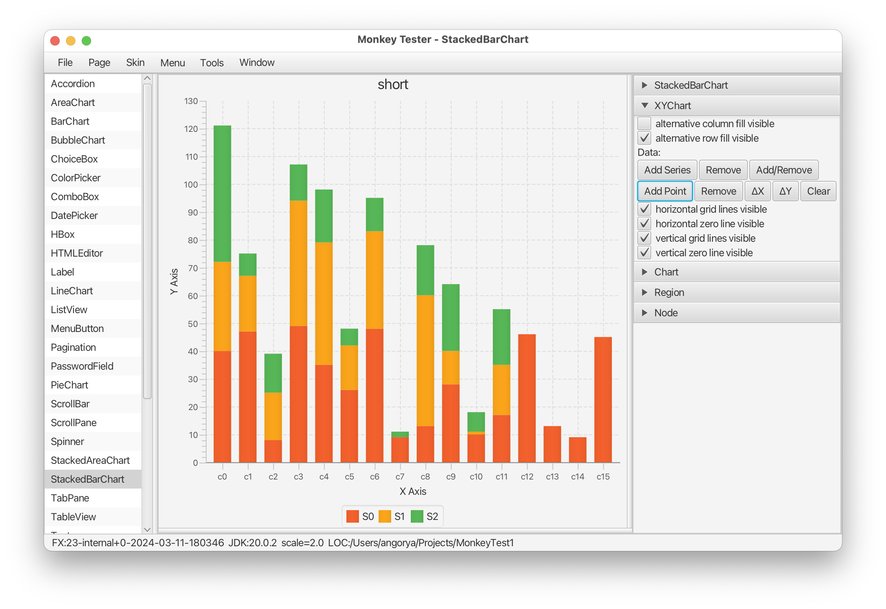

# Monkey Tester

This is a testing tool developed to support manual ad-hoc testing of individual JavaFX controls.




## Prerequisites

JavaFX SDK is required to build the tool.  The latest SDK can be found here:

https://jdk.java.net/javafx21/


## Build

The tool uses `ant` to build a non-modular JAR.  You'll need to specify the path to JavaFX SDK 20+:
```
ant -Djavafx.home=<JAVAFX>
```


## Run

The tool requires JDK 17+ and JavaFX 20+.

To launch, specify the path to the javaFX SDK lib/ folder on the command line, example:

```
java -p javafx-sdk-21/lib/ --add-modules ALL-MODULE-PATH -jar MonkeyTester.jar
```


## User Preferences

Applications stores the user preferences (window position, currently selected page, etc.) in `~/.MonkeyTester` directory.

To use a different directory, redefine the `user.home` system property, `-Duser.home=<DIR>`.

To disable saving, specify `-Ddisable.settings=true` VM agrument.


