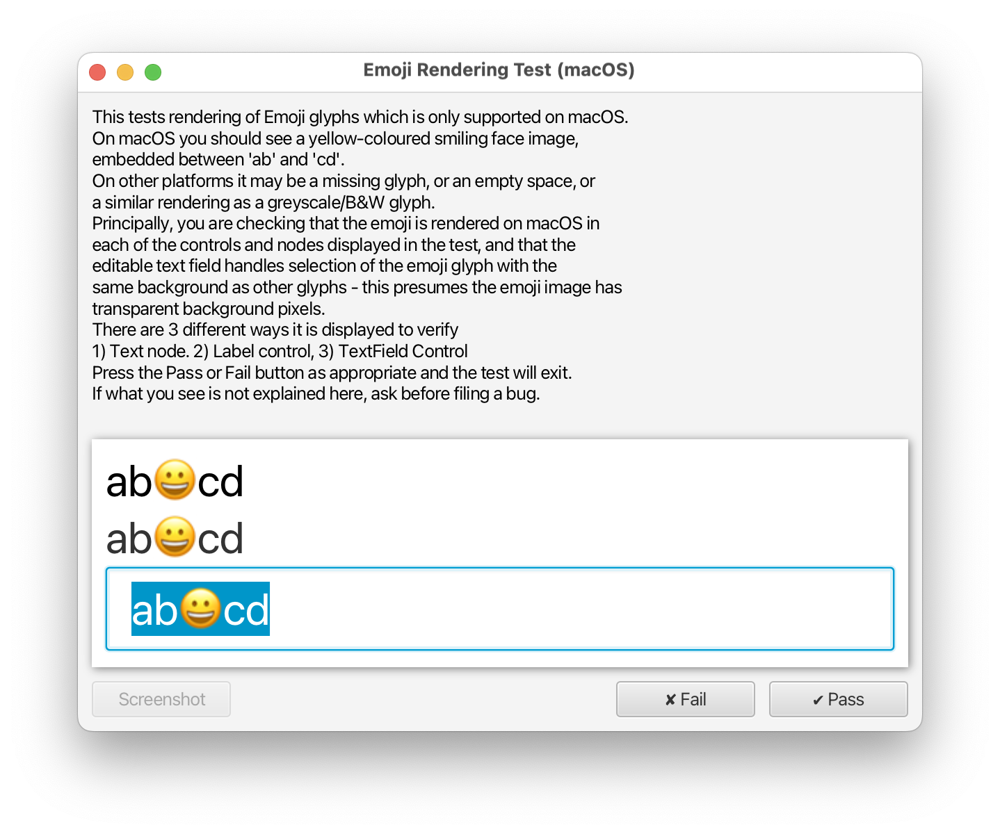

# Test Utilities

## ManualTestWindow

This facility provides the base class for manual tests which displays the test instructions,
the UI under test, and the Pass/Fail buttons.

Example:

```java
public class ManualTestExample extends ManualTestWindow {
    public ManualTestExample() {
        super(
            "Manual Test Example",
            """
            Instructions:
            1. you will see a button named "Test"
            2. press the button
            3. verify that the button can be pressed""",
            400, 250
        );
    }

    public static void main(String[] args) throws Exception {
        launch(args);
    }

    @Override
    protected Node createContent() {
        return new Button("Test");
    }
}
```

Resulting application window:



